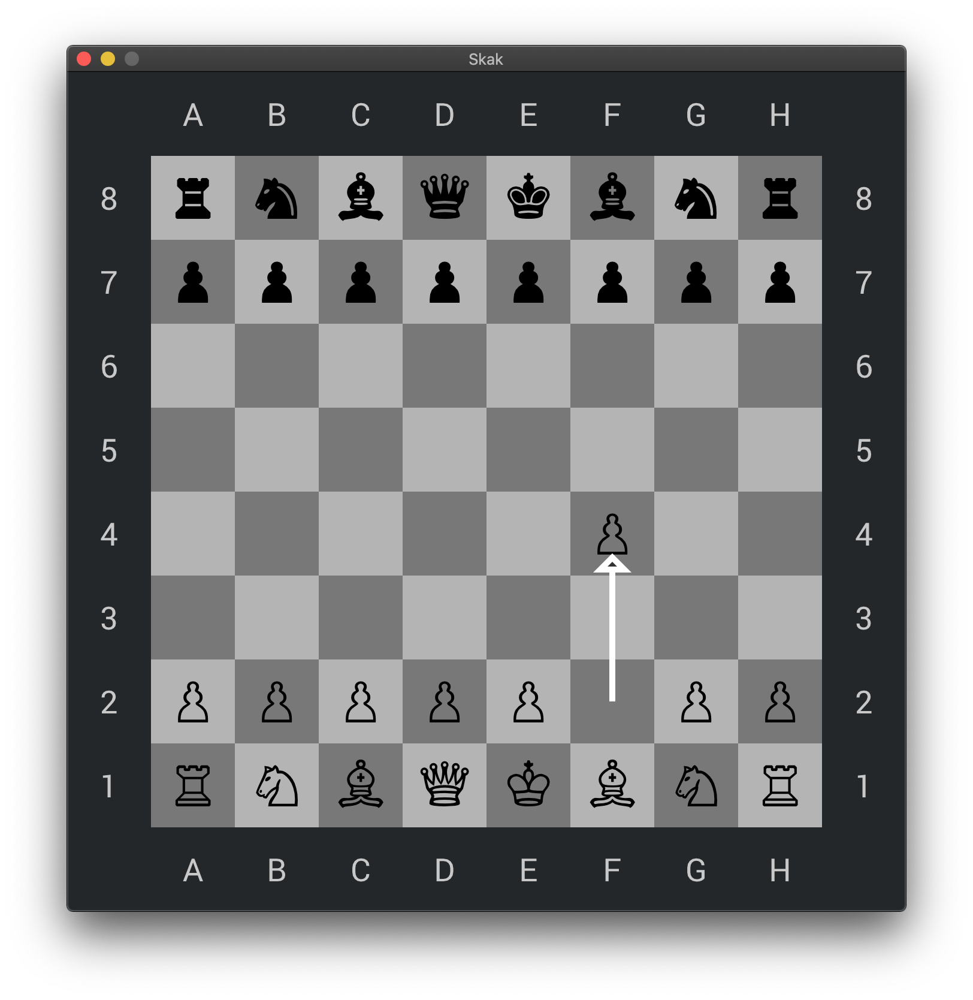

# Simple Chess
A simple chess implementation in c++.

## Instructions
You can either download a precompiled version from [here](https://github.com/mathiasgredal/NanoGUI-Chess/releases), or you can use the build instructions below:

#### Build Instructions:
You are going to need a working compiler either Clang, MinGW or GCC.
You have to have CMake installed.
- `git clone --recursive https://github.com/mathiasgredal/NanoGUI-Chess.git`
- `cd NanoGUI-Chess/src`
- `mkdir build`
- `cd build`
- `cmake ..`
- `cmake --build .`

Now you can simply run the program by clicking on the executable file or run it from terminal.

